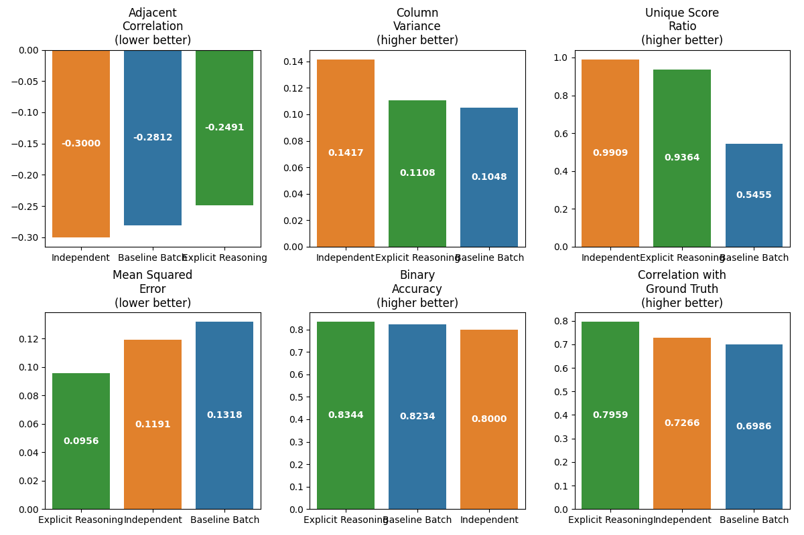

# Batch Evaluation Experiment

A research project examining uniformity bias in LLM batch evaluation and testing a novel filler token approach to improve evaluation independence.

## Overview

When evaluating multiple examples in a single prompt (batch evaluation), large language models often exhibit "uniformity bias" - assigning similar scores to unrelated examples. This project implements and tests a novel approach that forces the model to think independently about each example by inserting filler tokens between evaluations.

The experiment compares three evaluation approaches:
1. **Baseline Batch**: All examples evaluated in a single prompt (standard approach)
2. **Independent**: One example at a time (gold standard, but inefficient)
3. **Filler Token**: All examples in a batch, but with forced thinking steps between evaluations

## Key Findings

Our experiment demonstrates that the **Filler Token** approach significantly improves evaluation quality compared to traditional batch evaluation:

- **Reduced Uniformity Bias**: The filler token approach achieves almost the same level of independence as evaluating examples individually
- **Higher Accuracy**: Showed the lowest mean squared error (0.0956) and highest correlation with ground truth (0.7959)
- **Better Efficiency**: Maintains the cost and speed advantages of batch processing while achieving near-independent quality
- **Statistically Significant**: Improvements over both baseline batch and independent evaluation methods are statistically significant



## Project Structure
├── data/
│ ├── raw/ # Raw evaluation results
│ ├── processed/ # Processed analysis results
│ └── sample_data.yaml # Test examples with ground truth scores
├── src/
│ ├── prompts.py # Prompt templates for different approaches
│ ├── evaluation.py # Functions to run evaluations
│ ├── analysis.py # Analysis of uniformity bias and accuracy
│ └── visualization.py # Visualization of results
├── results/
│ ├── figures/ # Generated visualizations
│ └── tables/ # Tabular results
├── main.py # Main experiment script
└── requirements.txt # Dependencies


## Setup

1. Clone the repository:
```bash
git clone https://github.com/lukashondrich/batch_eval_experiment.git
cd batch_eval_experiment
```

2. Create a virtual environment and install dependencies:
```bash
python -m venv venv
source venv/bin/activate # On Windows: venv\Scripts\activate
pip install -r requirements.txt
```

3. Create a .env file with your OpenAI API key:
```bash
OPENAI_API_KEY=your_api_key_here
```

## Running the Experiment
Run the complete experiment:
```bash
python main.py
```

Options:

--model: Model to use (default: gpt-4o)
--trials: Number of trials per method (default: 3)
--temperature: Generation temperature (default: 0.0)
--output: Output file path (default: data/raw/evaluation_results.json)

Example with custom settings:
```bash
python main.py --model gpt-3.5-turbo --trials 5 --temperature 0.1
```

## Analyzing Results
After running the experiment, analyze the results:

```bash
python -m src.analysis
```

Generate visualizations:
```bash
python -m src.visualization
```

## Experiment Design
Evaluation Dimensions
The experiment evaluates language tutoring messages on four dimensions:

Lexical Complexity (LC): Vocabulary sophistication
Construction Complexity (CC): Syntactic structure
Formality Level (FL): Casual vs. formal register
Socratic Approach (SA): Questions vs. direct explanations

Test Examples
The test set includes 16 examples carefully designed to cover all possible combinations of high/low scores across the four dimensions.
Metrics
The experiment measures:

Uniformity Bias:

Adjacent example correlation
Column variance
Unique score ratio


Accuracy:

Mean squared error
Binary accuracy
Correlation with ground truth

## Detailed Results

### Uniformity Bias Metrics (lower is better):

            Method | Mean Adjacent Correlation | Column Variance | Unique Score Ratio
------------------ | ------------------------- | --------------- | ------------------
baseline_batch     | -0.281229                 | 0.104828        | 0.545455
independent        | -0.300026                 | 0.141682        | 0.990909
filler_token_batch | -0.249056                 | 0.110798        | 0.936364

### Accuracy Metrics (higher is better except MSE):

            Method |      MSE | Accuracy | Correlation
------------------ | -------- | -------- | -----------
baseline_batch     | 0.131750 | 0.823438 | 0.698578
independent        | 0.119125 | 0.800000 | 0.726555
filler_token_batch | 0.095609 | 0.834375 | 0.795868

### Statistical Significance

Several key improvements were found to be statistically significant:
- The filler token approach shows significantly better mean adjacent correlation than independent evaluation (p=0.0248)
- All MSE improvements across methods are statistically significant (p<0.001)
- Filler token accuracy is significantly better than independent evaluation (p=0.0134)
- Correlation improvements are significant across all method comparisons (p<0.001)

## License

MIT

## Citation

If you use this code or methodology in your research, please cite:

@misc{hondrich2025batcheval,
author = {Hondrich, Lukas J.},
title = {Reducing Uniformity Bias in LLM Batch Evaluation},
year = {2025},
publisher = {GitHub},
url = {https://github.com/lukashondrich/batch_eval_experiment}
}